

    <h1>MANUAL BOOK <b><i>IR Laptop</i></b></h1> 
    

        
        

            

                Informatics 
                Faculty of Engineering 
                Mulawarman University
            

        

    

    

    <h2>Group 1 Members</h2>
        

            Muhammad Irvan Hakim 2109106057 (The Leader) 
            M.Rangga Yaqub Wijaya 2109106104 
        

    

    

    <h2><i>Title : IR Laptop</i></h2>
        
    
    

 

## About Manual Book

This Manual Book is about how to use a Laptop Store Website IR Laptop

## Documentation
### 1. Landing Page
Dibawah ini adalah landing page dari website IR Laptop. Disini semua orang dapat melihat semua daftar laptop dan juga menggunakan filter harga laptop untuk memudahkan mencari laptop sesuai dengan rentang harga yang di inginkan. Semua orang juga dapat melihat komentar-komentar user mengenai laptop di website ini. Kalau mau akses fitur berikutnya, diperlukan aksi login dengan cara klik tombol "login" 

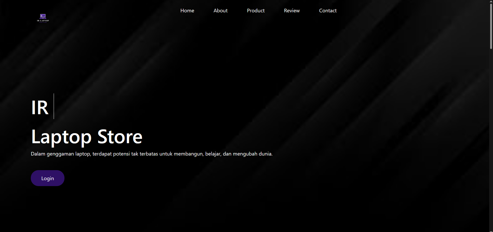
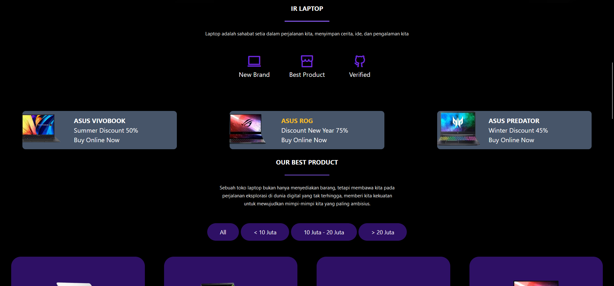
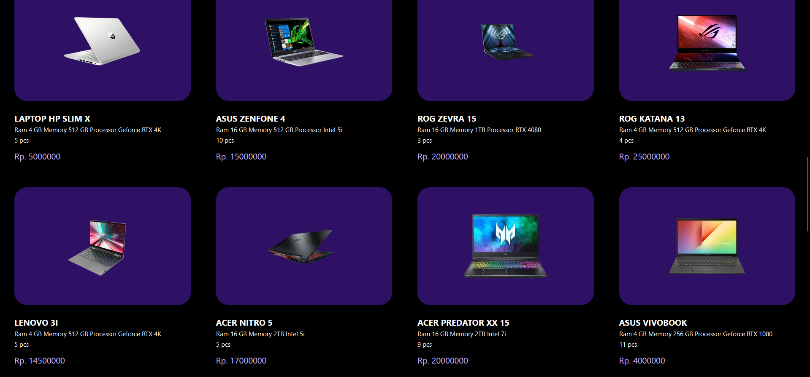
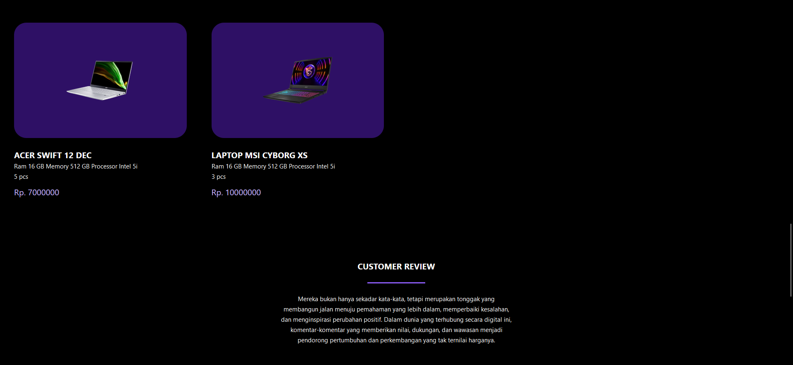
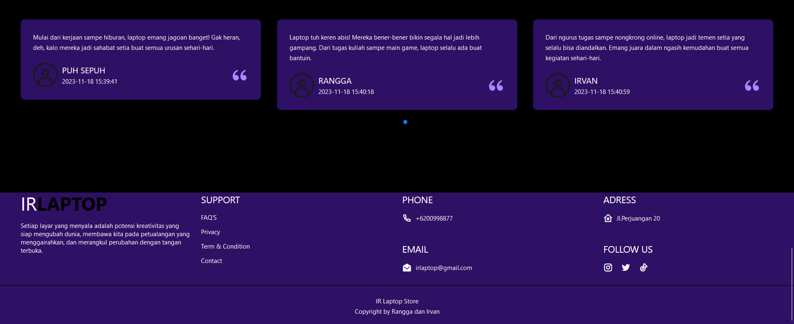

### 2. Login dan Registration Page
Dibawah ini adalah Login page dan Registration Page dari website IR Laptop. Login page berfungsi untuk mengautentikasi user yang boleh masuk ke menu user maupun menu admin. Menu admin hanya bisa di akses dengan memasukkan username "admin" dan password "admin". Sedangkan menu user hanya bisa diakses jika sudah mempunyai akun user. Untuk memiliki akun user, harus pergi ke registration page dengan cara klik "register here" dan masukkan username dan password sesui keinginan anda.

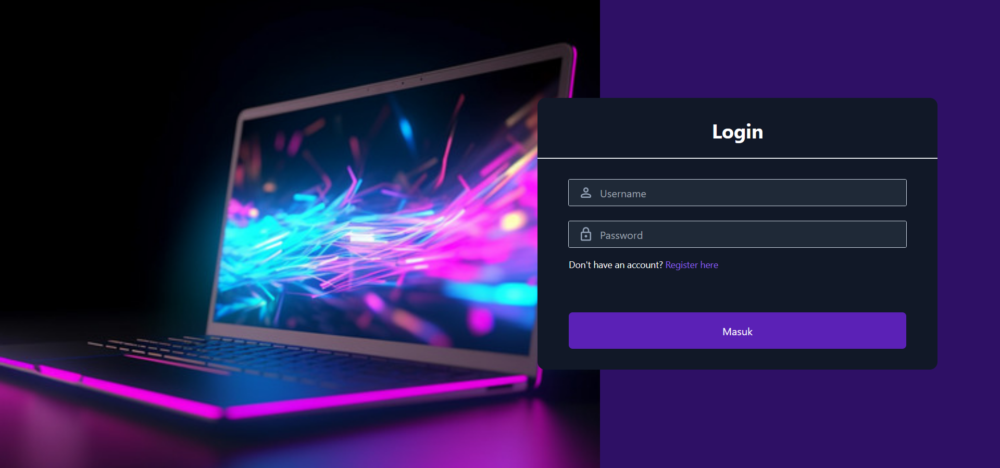
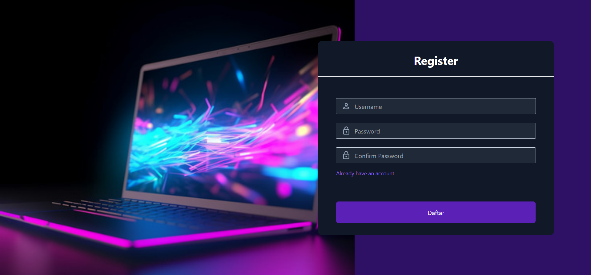

### 3. Admin -> Menu Admin Page
Dibawah ini adalah Menu Admin page dari website IR Laptop. Menu admin menyediakan kolom komentar yang berisikan komentar-komentar dari user. Klik komponen pada nav bar untuk pergi ke page selanjutnya dari menu admin. 

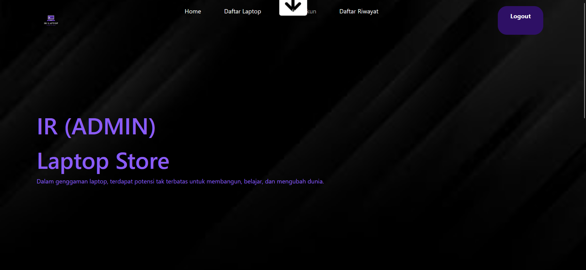
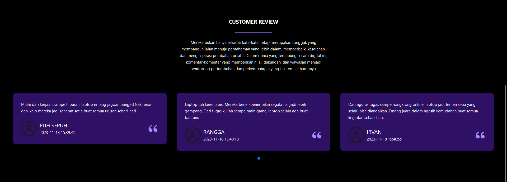
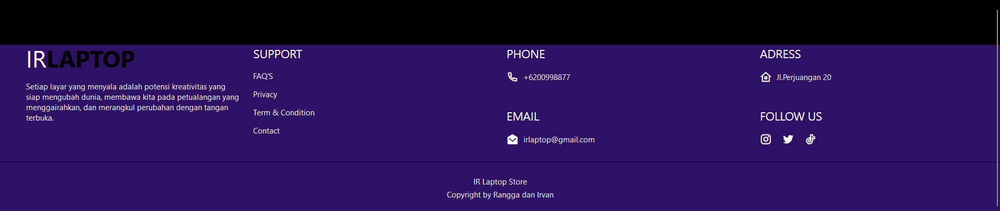

### 4. Admin -> Daftar Laptop Page
Dibawah ini adalah Daftar Laptop page dari website IR Laptop. Daftar laptop ini hanya dapat di akses oleh pihak admin karena disini admin dapat melakukan CRUD data laptop. Admin juga dapat mencari laptop yang di inginkan menggunakan merk laptop

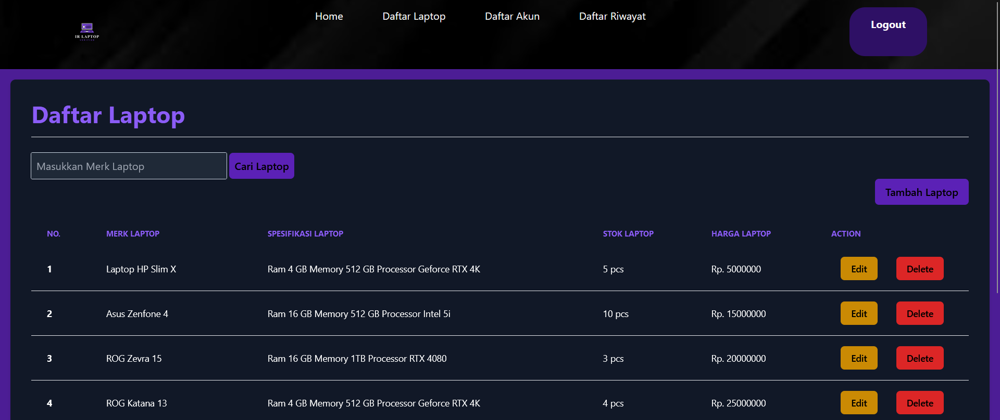
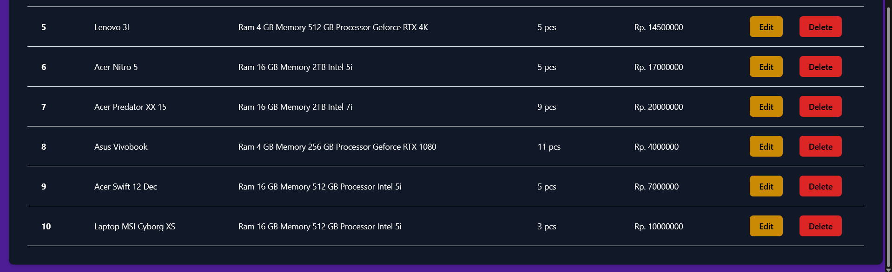

### 5. Admin -> Tambah Laptop Page
Dibawah ini adalah Tambah Laptop page dari website IR Laptop. Disini admin dapat memasukkan data laptop termasuk gambar laptop yang ingin ditambahkan kedalam website IR Laptop.

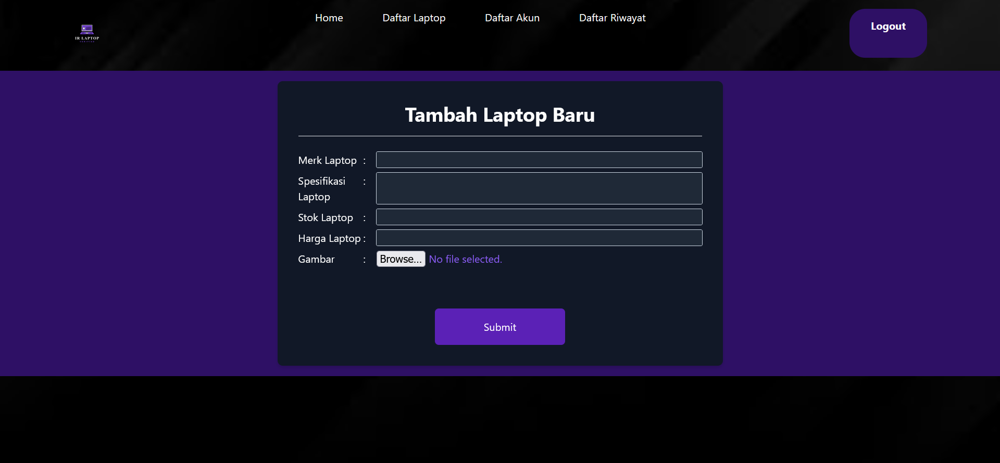

### 6. Admin -> Edit Laptop Page
Dibawah ini adalah Edit Laptop page dari website IR Laptop. Disini admin dapat mengubah data laptop yang ada didalam website IR Laptop.

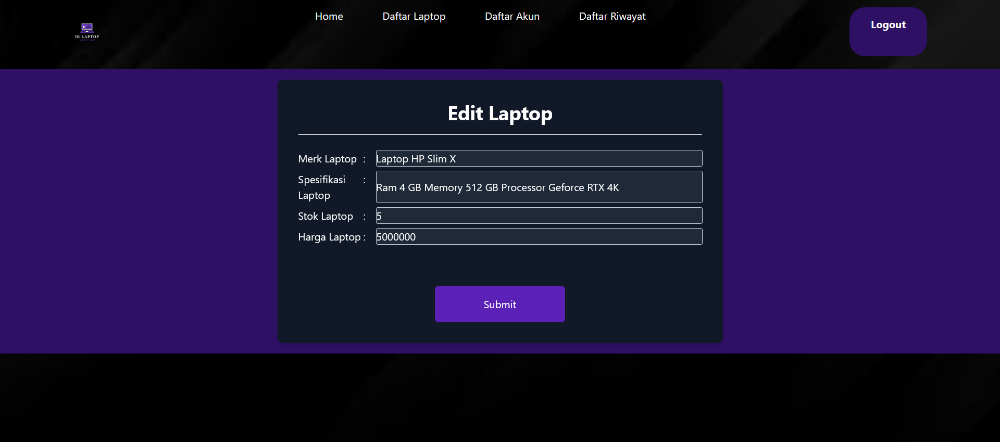

### 7. Admin -> Daftar Akun Page
Dibawah ini adalah Daftar Akun page dari website IR Laptop. Daftar akun ini hanya dapat di akses oleh pihak admin karena disini admin dapat melihat ataupun menghapus akun yang telah terdaftar di website ini. Admin juga dapat mencari akun yang di inginkan menggunakan username akun.
 
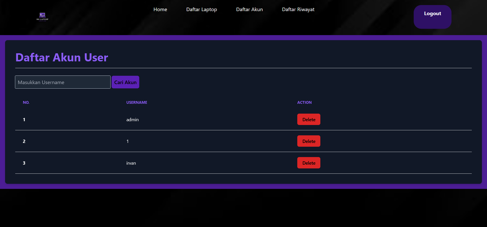

### 8. Admin -> Daftar Riwayat Pembelian Page
Dibawah ini adalah Daftar Riwayat Pembelian page dari website IR Laptop. Daftar Riwayat Pembelian ini berisikan riwayat-riwayat pembelian yang telah dilakukan oleh pihak user dan riwayat ini hanya dapat di lihat oleh pihak admin. Admin juga dapat mencari riwayat yang di inginkan menggunakan username pembeli.

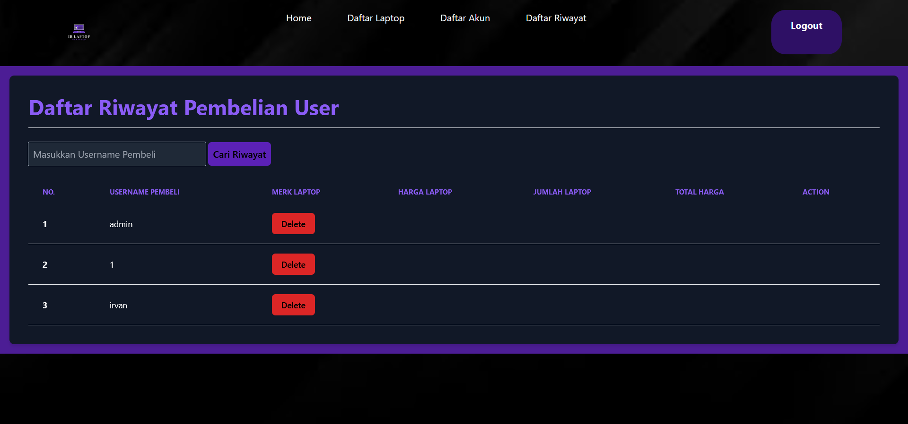

### 9. User -> Menu User Page
Dibawah ini adalah Menu User page dari website IR Laptop. Disini user dapat melihat semua daftar laptop dan juga user dapat menggunakan filter harga laptop untuk memudahkan user dalam mencari laptop sesuai dengan rentang harga yang di inginkan serta melihat berbagai komentar user lain yang ada di website IR Laptop. Untuk masuk ke menu pembelian, user harus klik salah satu laptop yang ingin dibeli. Jika user ingin menambahkan komentar, user dapat langsung klik "Give Comment" yang akan mengarahkan user ke Give Comment page.

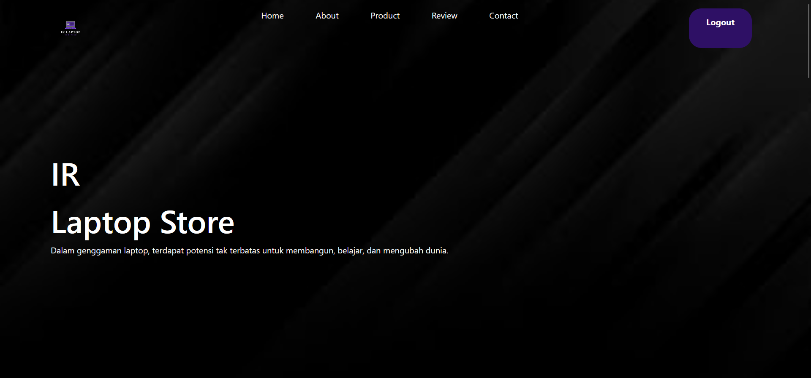
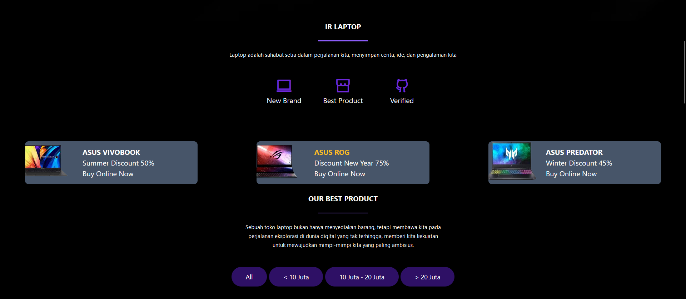
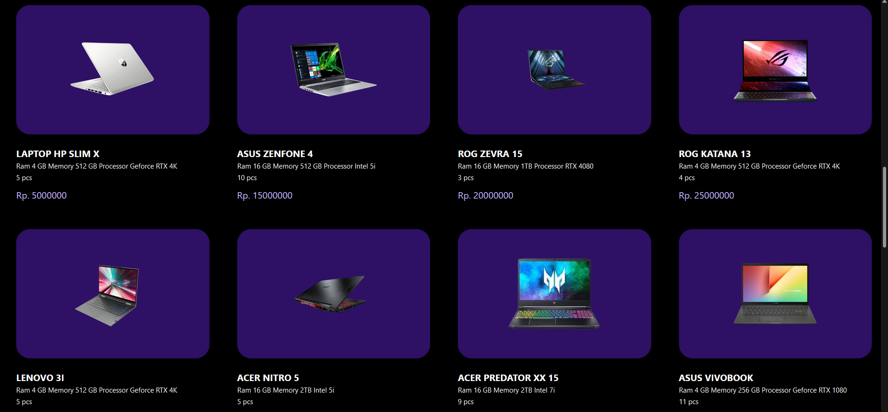
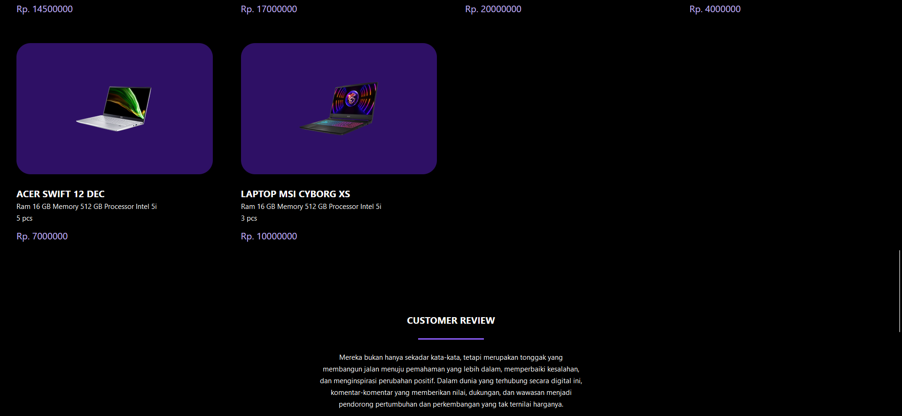
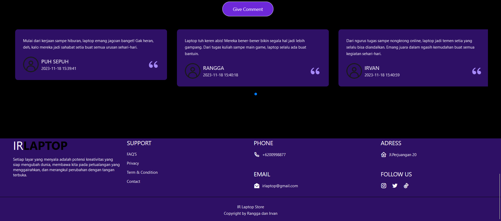

### 10. User -> Give Comment Page
Dibawah ini adalah Give Comment page dari website IR Laptop. Disini user dapat memberikan username yang ingin user tunjukkan di kolom komentar jika tidak ingin menggunakan nama asli dan user juga dapat mengisi kolom "isi_komentar" yang nanti nya akan dapat dilihat oleh semua user.

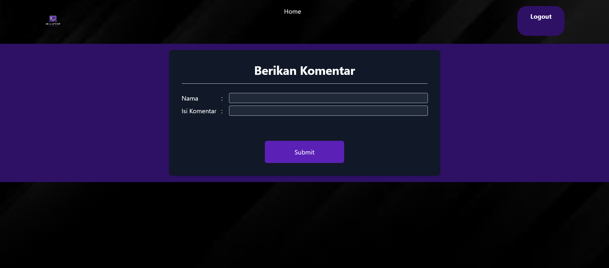

### 11. User -> Pembelian Page
Dibawah ini adalah Pembelian page dari website IR Laptop. Disini user dapat memasukkan jumlah laptop yang ingin dibeli lalu klik "Submit" untuk pemrosesan lebih lanjut.

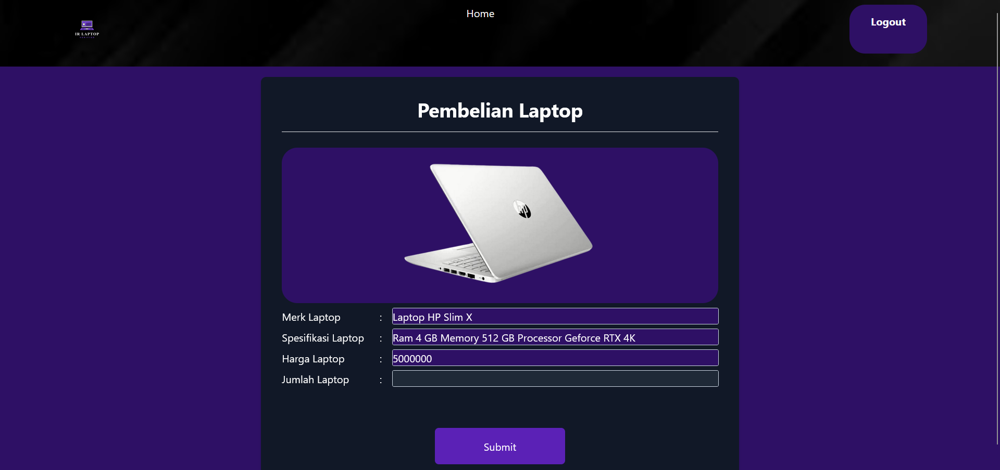

    <h1>The End of Manual Book <b><i>IR Laptop</i></b></h1>
    

        
<h2>Thank You!!<h2>
    

